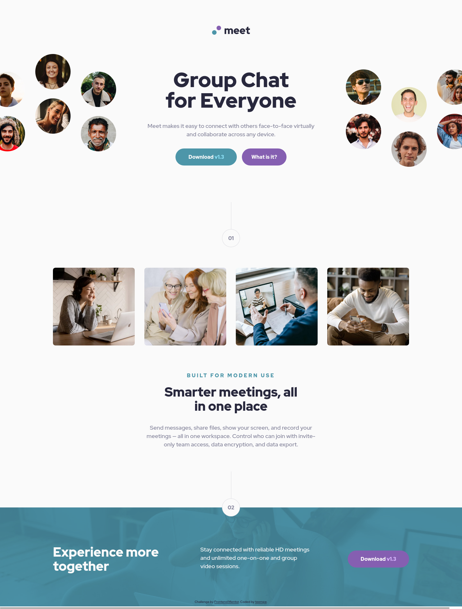

# Frontend Mentor - Meet landing page solution

This is a solution to the [Meet landing page challenge on Frontend Mentor](https://www.frontendmentor.io/challenges/meet-landing-page-rbTDS6OUR). Frontend Mentor challenges help you improve your coding skills by building realistic projects. 

## Table of contents

- [Overview](#overview)
  - [The challenge](#the-challenge)
  - [Screenshot](#screenshot)
  - [Links](#links)
- [My process](#my-process)
  - [Built with](#built-with)
- [Author](#author)

## Overview

### The challenge

Users should be able to:

- View the optimal layout depending on their device's screen size
- See hover states for interactive elements

### Screenshot

### Links

- Solution URL: [https://github.com/teempe/frontend-mentor-meet-landing-page.git](https://github.com/teempe/frontend-mentor-meet-landing-page.git)
- Live Site URL: [https://teempe.github.io/frontend-mentor-meet-landing-page/](https://teempe.github.io/frontend-mentor-meet-landing-page/)

## My process

### Built with

- Semantic HTML5 markup
- CSS custom properties
- Flexbox
- CSS Grid
- Mobile-first workflow

## Author

- Website - [teempe](https://github.com/teempe)
- Frontend Mentor - [@teempe](https://www.frontendmentor.io/profile/teempe)
